# 大型动物

## 猫

### B区猫猫

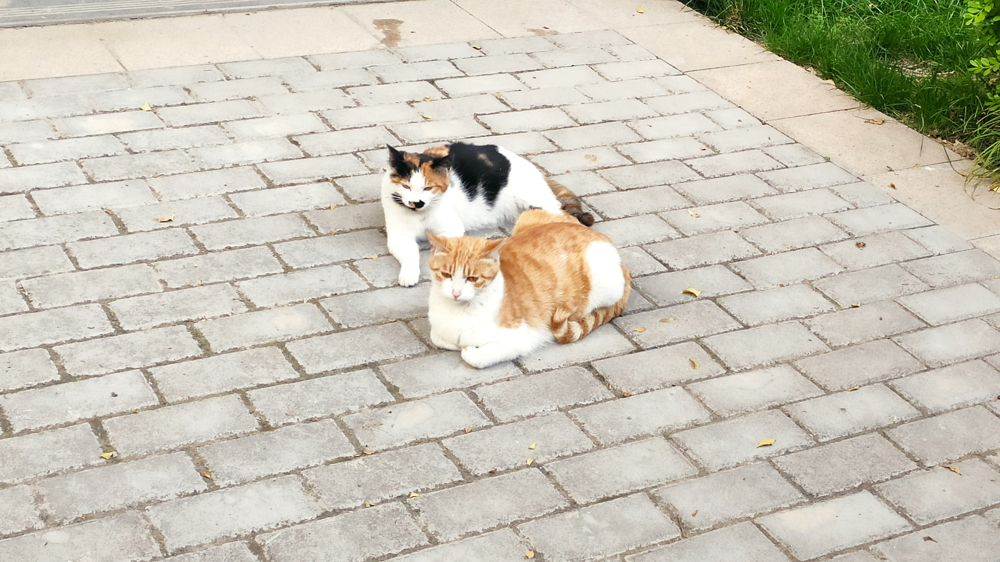

> 德华拍摄于2022年4月7日B区门口。

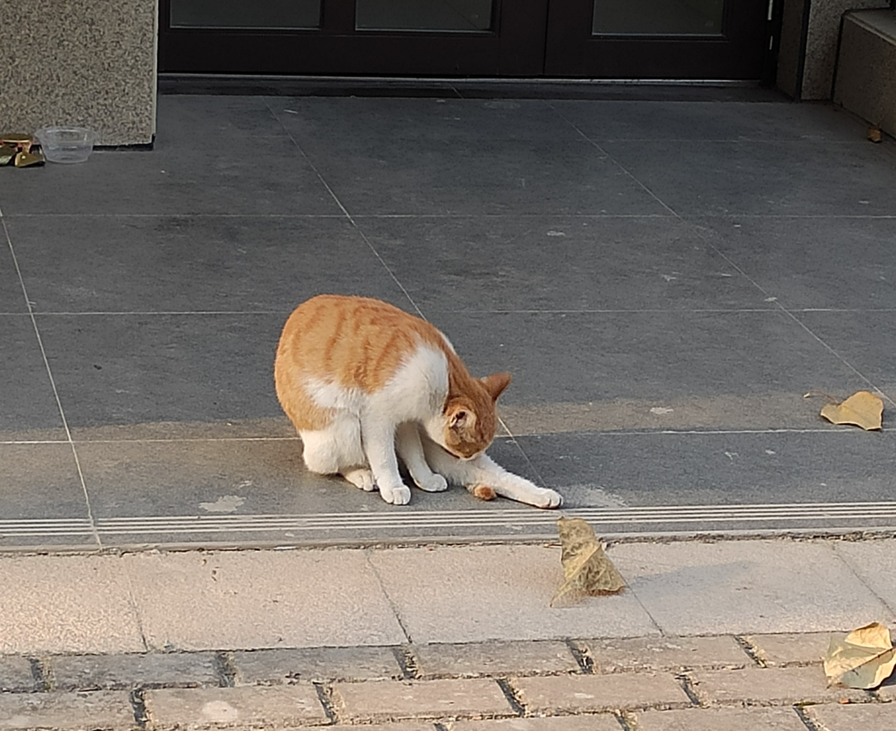

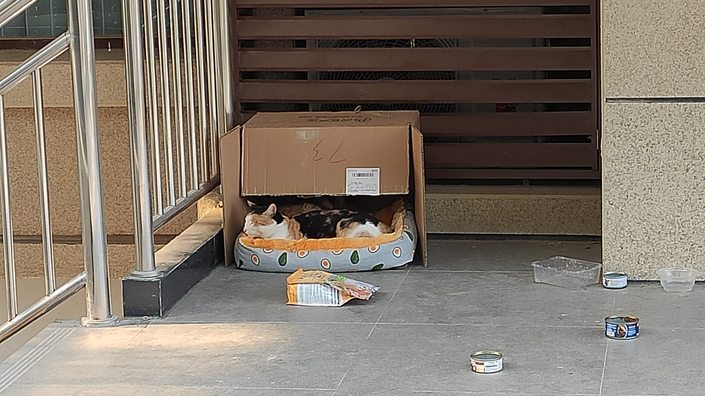

> 德华拍摄于2021年11月19日B区门口。

> 德华拍摄于2022年6月16日B南区物业门口。

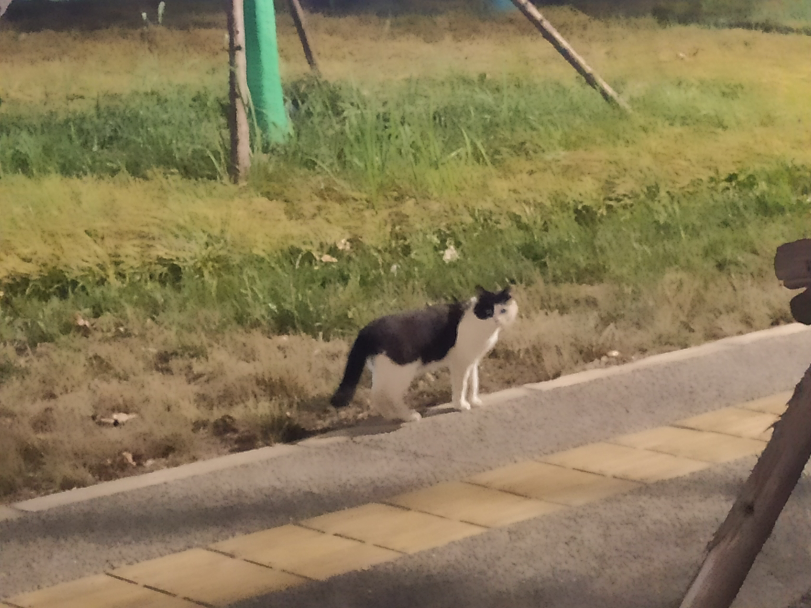

> 德华拍摄于2022年6月23日西玉兰路。

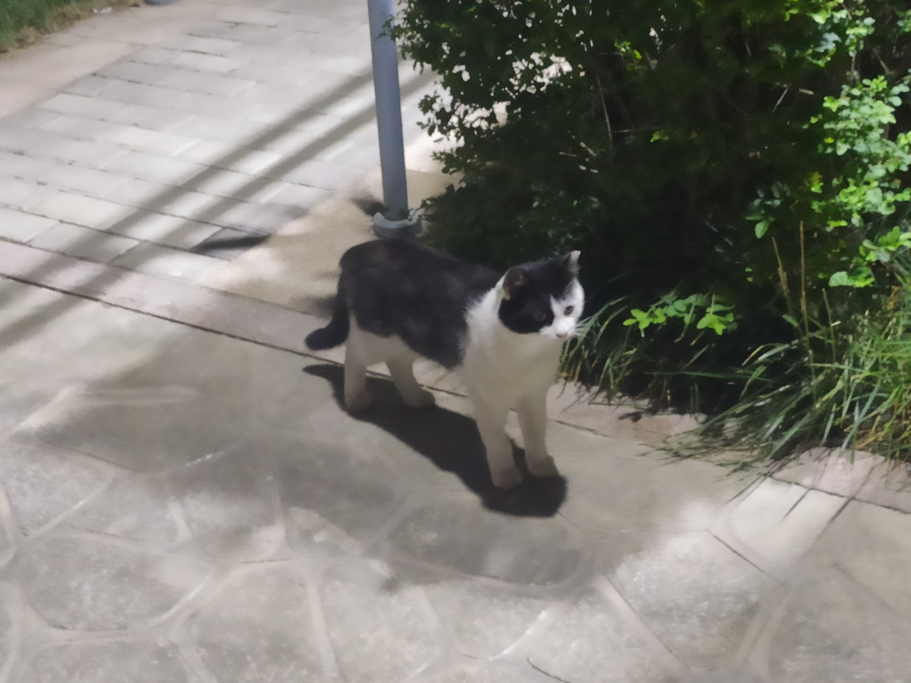

> 德华拍摄于2022年6月28日B北区。

猫，属于猫科动物，是全世界家庭中较为广泛的宠物。

*港里面好多猫猫狗狗，我住的B北区有一只三花一只橘猫。*

## 红嘴蓝鹊

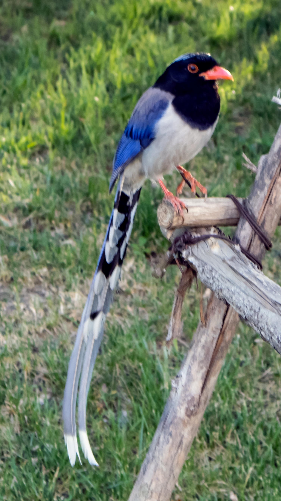

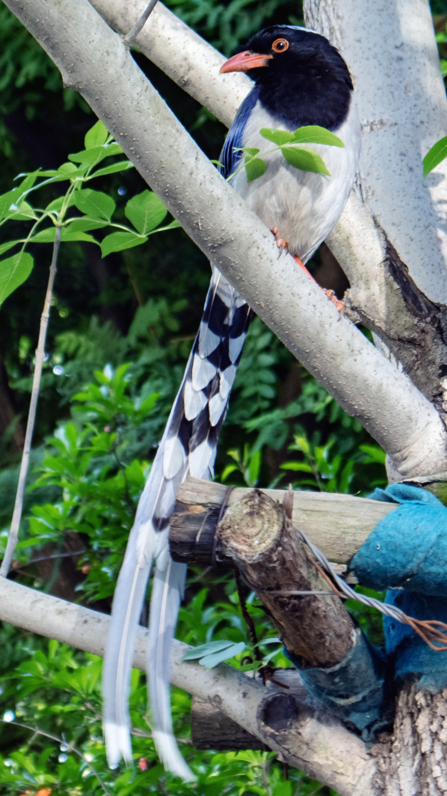

> Why拍摄于2022年4月28日，在涵英楼地下超市对面的小山坡。

红嘴蓝鹊（Urocissa erythrorhyncha）是大型鸦类，体长54-65厘米。嘴、脚红色，头、颈、喉和胸黑色，头顶至后颈有一块白色至淡蓝白色或紫灰色块斑，其余上体紫蓝灰色或淡蓝灰褐色。尾长呈凸状具黑色亚端斑和白色端斑。下体白色。 黄嘴蓝鹊外形和羽色和该种非常相似，但黄嘴蓝鹊嘴为黄色，头部仅枕有白色块斑。

常见并广泛分布于林缘地带、灌丛甚至村庄。性喧闹，结小群活动。以果实、小型鸟类及卵、昆虫为食，常在地面取食。主动围攻猛禽。喜马拉雅山脉、印度东北部、中国、缅甸及印度支那均有分布。

## 狗

### 新港土狗大黄

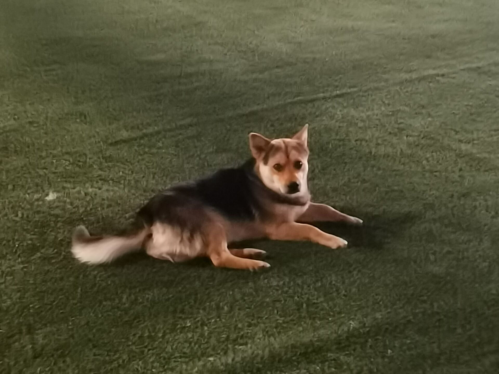

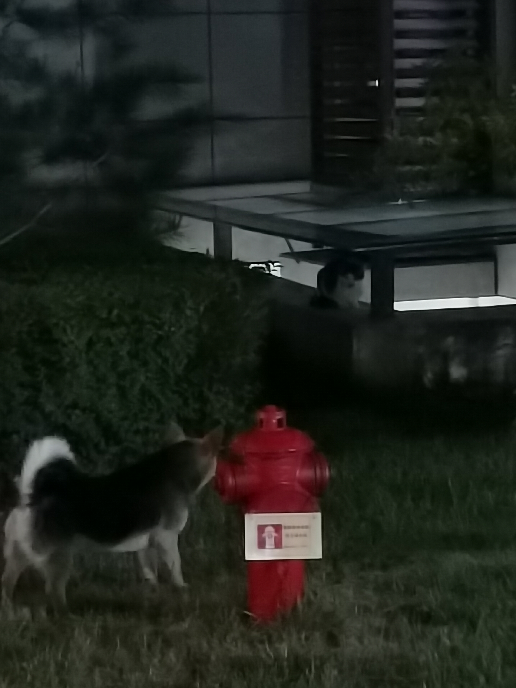

> XWD拍摄于2022年5月6日操场。

狗，脊索动物门、脊椎动物亚门、哺乳纲、真兽亚纲、食肉目、裂脚亚目、犬科动物。“狗是人类最好的朋友。”

*可以摸，还会追猫，作为港里唯一的一条野狗，大黄能活到今天不是没有原因的。*

### 小白

> 德华拍摄于2022年6月19日涵英楼北操场

*小白挺可爱的，听说也很听话，我怕狗就没摸它。出现频率比大黄低一些。*

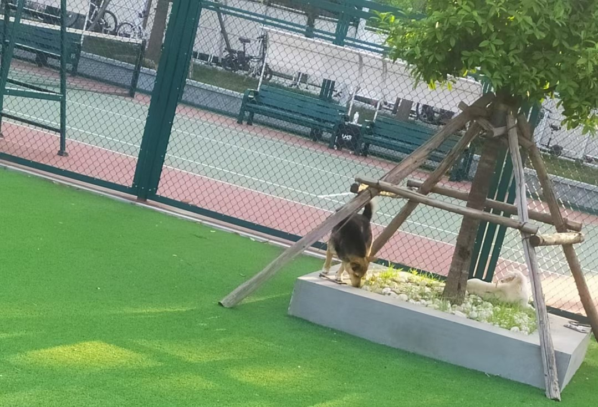

> 伤不起拍摄于2022年6月23日网球场西侧

*二者的历史性会晤*

## 新港白鸽

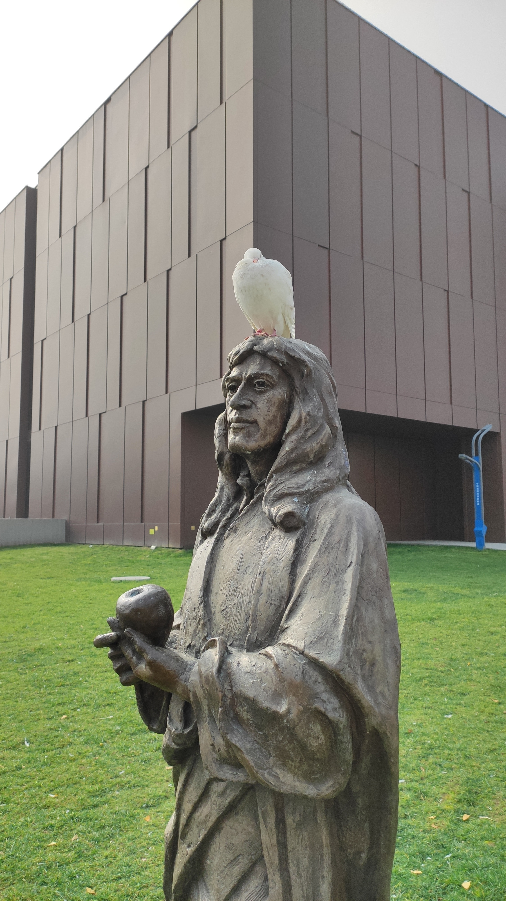

> 德华拍摄于2021年11月4日牛顿雕像

> 德华拍摄于2022年6月21日涵英楼南广场

鸽形目鸠鸽科鸽属下的动物

*旁边有售货机卖鸽粮，也可以自己网上买一大袋子来喂，完全不怕人。开学和毕业典礼的时候会放飞，很好看。*
