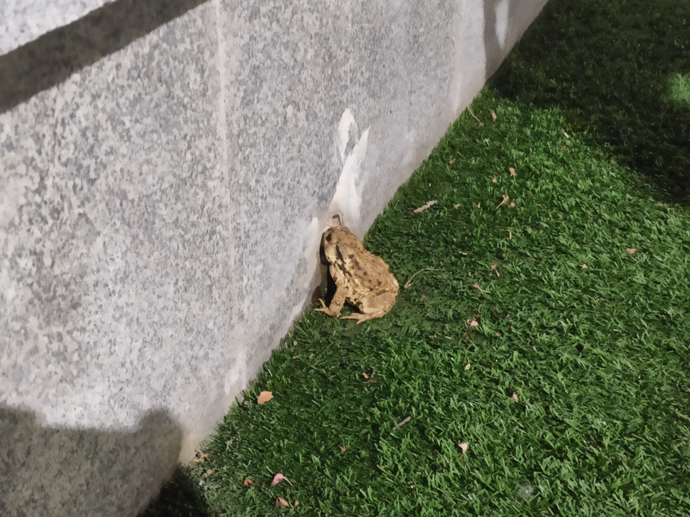
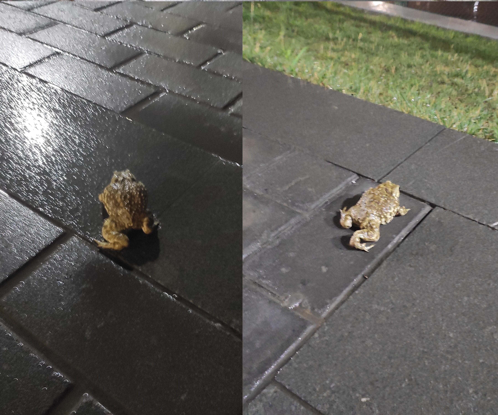
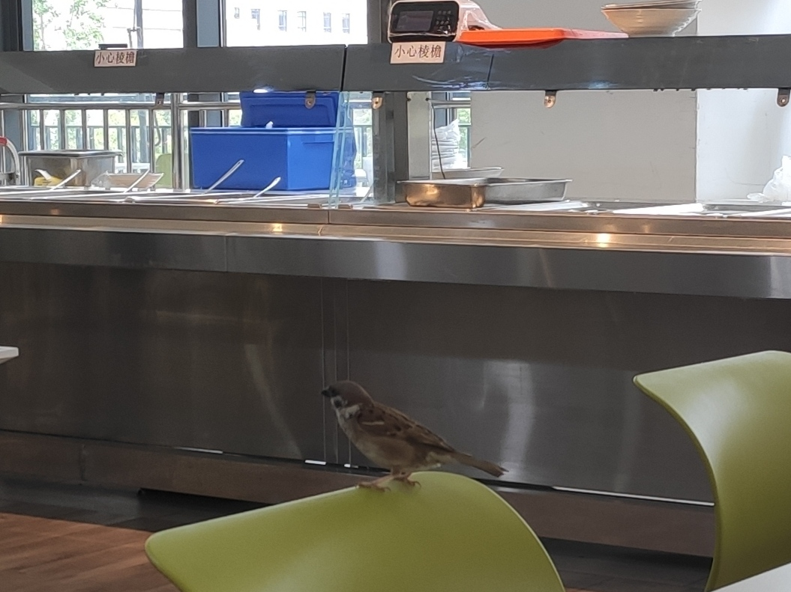
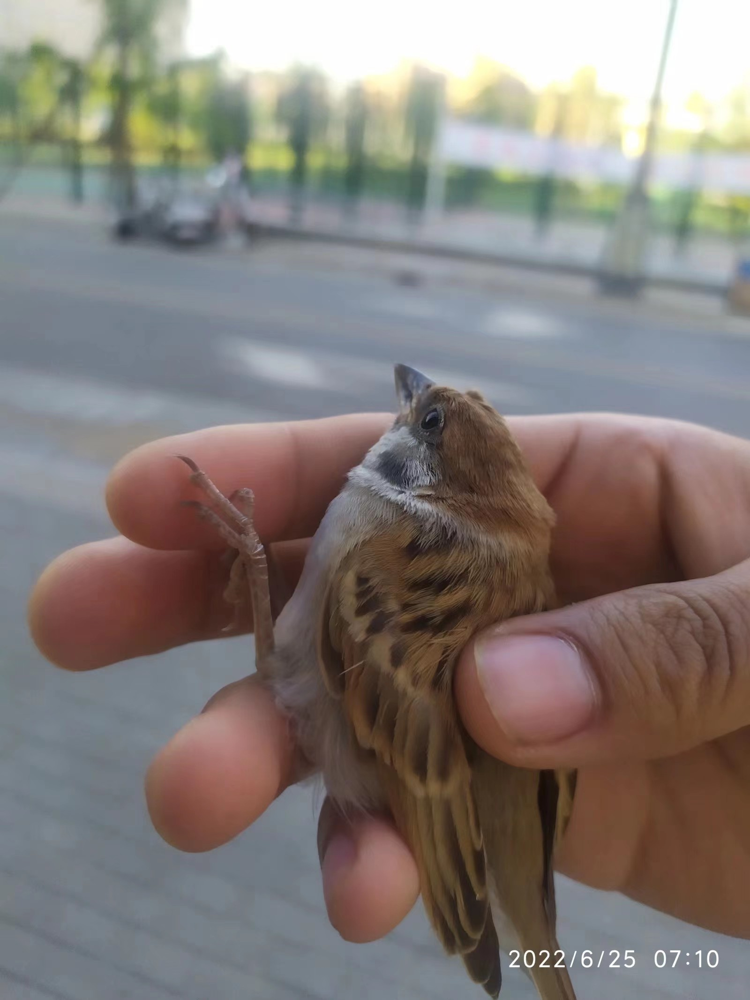
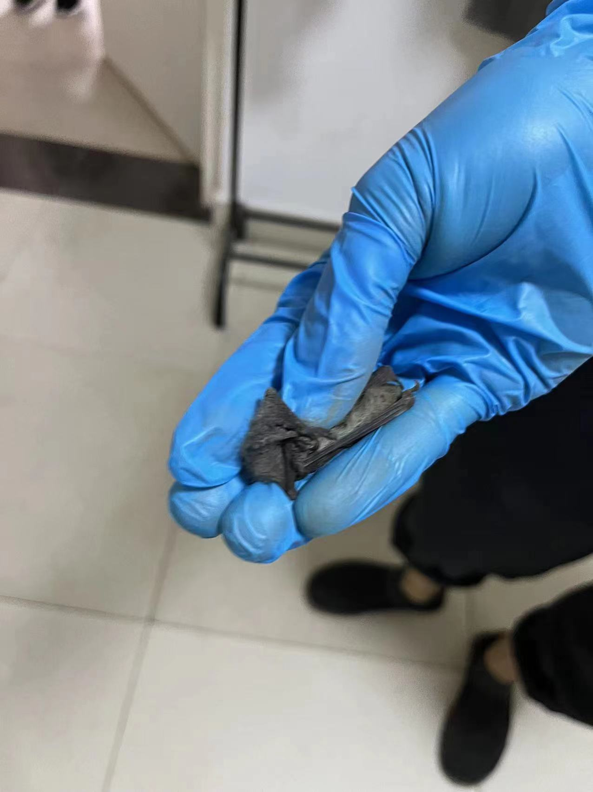
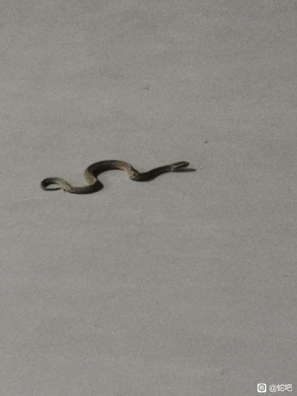
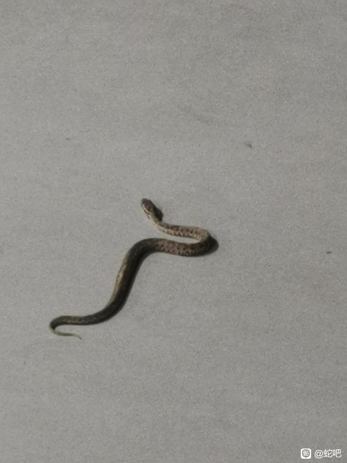

# 大型动物

## 猫

### B区猫猫

> 德华拍摄于2022年4月7日B区门口。

> 德华拍摄于2021年11月19日B区门口。

> 德华拍摄于2022年6月16日B南区物业门口。

> 德华拍摄于2022年6月23日西玉兰路。

> 德华拍摄于2022年6月28日B北区。

猫，属于猫科动物，是全世界家庭中较为广泛的宠物。

*港里面好多猫猫狗狗，我住的B北区有一只三花一只橘猫。*

## 红嘴蓝鹊

> Why拍摄于2022年4月28日，在涵英楼地下超市对面的小山坡。

红嘴蓝鹊（Urocissa erythrorhyncha）是大型鸦类，体长54-65厘米。嘴、脚红色，头、颈、喉和胸黑色，头顶至后颈有一块白色至淡蓝白色或紫灰色块斑，其余上体紫蓝灰色或淡蓝灰褐色。尾长呈凸状具黑色亚端斑和白色端斑。下体白色。 黄嘴蓝鹊外形和羽色和该种非常相似，但黄嘴蓝鹊嘴为黄色，头部仅枕有白色块斑。

常见并广泛分布于林缘地带、灌丛甚至村庄。性喧闹，结小群活动。以果实、小型鸟类及卵、昆虫为食，常在地面取食。主动围攻猛禽。喜马拉雅山脉、印度东北部、中国、缅甸及印度支那均有分布。

## 狗

### 新港土狗大黄

> XWD拍摄于2022年5月6日操场。

狗，脊索动物门、脊椎动物亚门、哺乳纲、真兽亚纲、食肉目、裂脚亚目、犬科动物。“狗是人类最好的朋友。”

*可以摸，还会追猫，作为港里唯一的一条野狗，大黄能活到今天不是没有原因的。*

### 小白

> 德华拍摄于2022年6月19日涵英楼北操场

*小白挺可爱的，听说也很听话，我怕狗就没摸它。出现频率比大黄低一些。*

> 伤不起拍摄于2022年6月23日网球场西侧

*二者的历史性会晤*

## 新港白鸽

> 德华拍摄于2021年11月4日牛顿雕像

> 德华拍摄于2022年6月21日涵英楼南广场

鸽形目鸠鸽科鸽属下的动物

*旁边有售货机卖鸽粮，也可以自己网上买一大袋子来喂，完全不怕人。开学和毕业典礼的时候会放飞，很好看。*

## 蟾蜍

> 德华拍摄于2022年6月24日操场南侧。

> 德华拍摄于2022年7月12日操场北侧。

蟾蜍，也叫蛤蟆。两栖动物，体表有许多疙瘩，内有毒腺，俗称癞蛤蟆、癞猴子、癞刺、癞疙宝。在我国分为中华大蟾蜍和黑眶蟾蜍两种。从它们身上提取的蟾酥以及蟾衣则是我国紧缺的药材。蟾蜍水陆两栖，皮肤布满小孔具有渗透性，外加它们从出生就没有羊膜和壳等结构的保护，致使它们对环境的敏感性要高于其他类群，两栖动物被认为是检测环境变化的风向标。

*总在操场听见蛤蟆叫，这天跑步时候看见有人围着拍，总算让我逮到了。*

## 麻雀

> 德华拍摄于2022年6月26日C区食堂二楼。

> 伤不起拍摄于2022年6月25日网球场外

麻雀（Passer）：是雀科麻雀属27种小型鸟类的统称。它们的大小、体色甚相近。一般上体呈棕、黑色的斑杂状，因而俗称麻雀。初级飞羽9枚，外侧飞羽的淡色羽缘（第一枚除外）在羽基和近端处，形稍扩大，互相骈缀，略成两道横斑状，在飞翔时尤见明显。嘴短粗而强壮，呈圆锥状，嘴峰稍曲。除树麻雀外，雌雄均异色。

*麻雀随处可见，但是这些家伙太精了，每次要拍照它们就跑了，这次总算让我拍到了（虽然很糊）。*

## 蝙蝠

> 舟姐拍摄于2022年7月11日C区宿舍内

蝙蝠（学名：Chiroptera）是[脊索动物门](https://baike.baidu.com/item/脊索动物门/3516708)、哺乳纲下的一类动物，是唯一能够真正飞翔的哺乳动物；除一般哺乳动物的特点外，还有一系列适应飞行的形态特征 。最小的是混合蝠，体重仅有1.9克，翼展16厘米；一些[狐蝠](https://baike.baidu.com/item/狐蝠/21778)的体重可以超过1.3千克，翼展可达1.7米。蝙蝠全身骨质轻，头骨愈合程度较高，[肩带](https://baike.baidu.com/item/肩带/4425021)发达，胸骨具龙骨状突起。后肢胫骨、腓骨退化。耳壳发达，常具发达的[耳屏](https://baike.baidu.com/item/耳屏/4202286)或对耳屏。翼膜、耳、唇等处有丰富的感觉毛。颜色多样，大多是褐色、灰色和黑色。

*创新港的蝙蝠其实很多，下雨前空气湿度大虫子低飞它们就更多了。平时晚上操场大灯旁边飞舞的都是蝙蝠，好多时候大家都没有注意。*

## 蛇

### 短尾蝮

> iT。iT拍摄于2022年07月18日，四号楼1楼。

短尾蝮（学名：*Gloydius brevicaudus*）又称草上飞、地扁蛇，剧毒。体较短粗，头略呈三角形，与颈区分明显，吻棱明显，尾短，具管牙；有颊窝。头背深棕色，体腹面灰白色，尾尖棕黑色。中国国内分布于北京、天津、河北、辽宁、上海、江苏、浙江、安徽、福建、江西、湖北、湖南、四川、贵州、陕西、甘肃、广东（南澳）。

*创新港还有这种东西着实把我吓了一跳，老兄上[蛇吧](https://tieba.baidu.com/p/7930370200?pid=144788736187&cid=0#144788736187)请教了确实是毒蛇，平时要注意一下了。*