# 小型动物

*编者注：此页面可能会引起您的不适，请谨慎观看！*

## 中华露螽

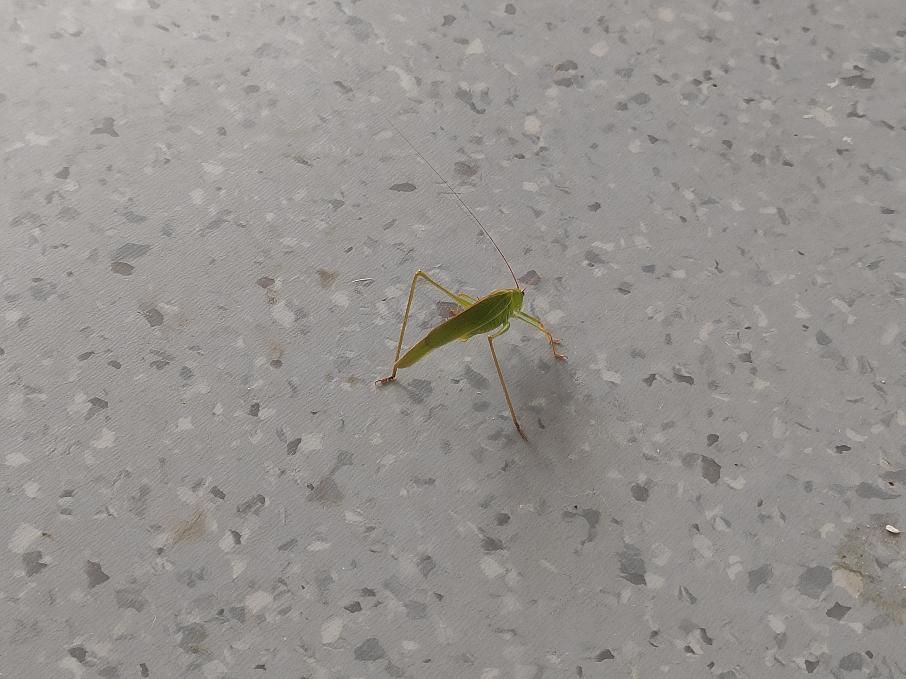

> 德华拍摄于2022年6月15日四号巨构楼内。

中华露螽（ Phaneroptera sinensis Uvarov)属昆虫纲直翅目，是一种常见的昆虫。该科种类与自然植被关系密切,有些种类是重要的害虫,有些种类对环境变化非常敏感,是重要的生态指示种.它们许多种类具有明显的经济学意义

寄生范围：瓜、菜豆、蔬菜。

地理分布：陕西；庆阳（正宁）。

*到工位上班的时候看到地上趴着一个绿虫子，所以拍下来查了一下。*

## 东亚飞蝗

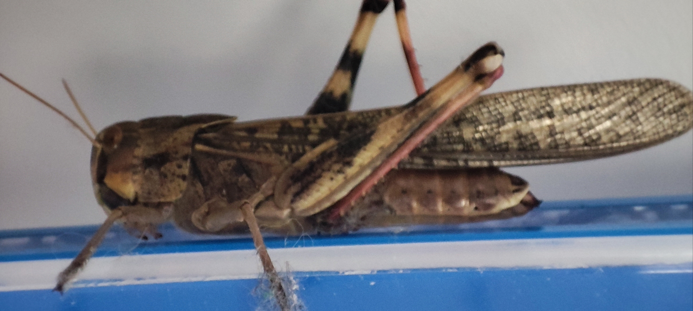

> Why拍摄于2021年8月30日四号巨构2楼。

东亚飞蝗（Locusta migratoria manilensis）是飞蝗科、飞蝗属昆虫飞蝗下的一个亚种。体大型，绿色或黄褐色，匀称。东亚飞蝗主要分布在中国东部，黄淮海平原是主要发生和危害区域。

## 蟋蟀
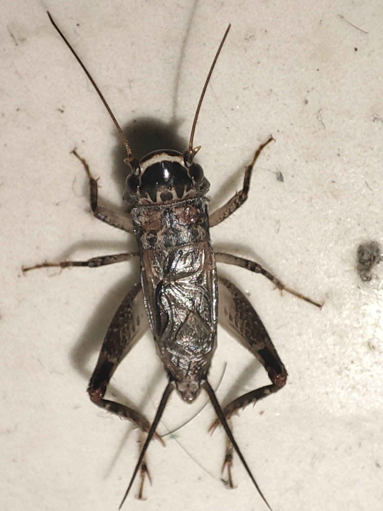

> Why拍摄于2021年8月21日B区b11楼。

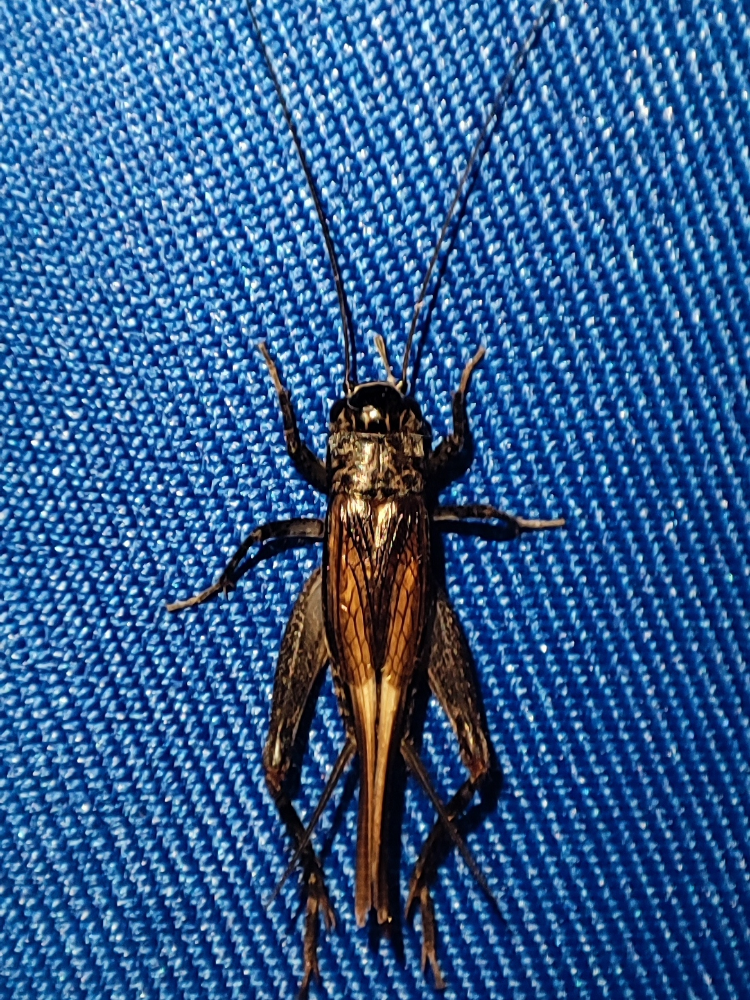

> Why拍摄于2021年8月21日B区b11楼。

蟋蟀（Gryllulus）无脊椎动物，昆虫纲，直翅目，蟋蟀总科。亦称促织，俗名蛐蛐、夜鸣虫（因为它在夜晚鸣叫）、将军虫。蟋蟀是一种古老的昆虫，至少已有1.4亿年的历史，还是在古代和现代玩斗的对象。

## 蟑螂
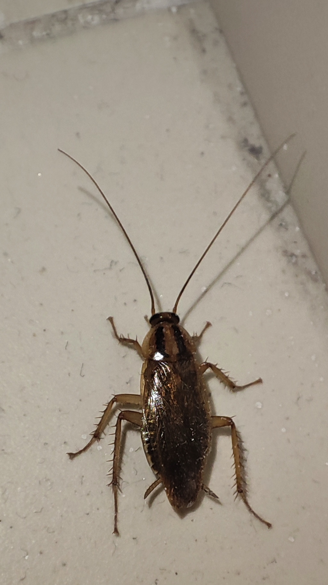

> Why拍摄于2021年9月1日B区b11楼。

蟑螂， 属于节肢动物门、昆虫纲、蜚蠊目（Blattaria），俗称蟑螂，是常见的医学昆虫。蟑螂体扁平，黑褐色，通常中等大小。头小，能活动。触角长丝状，复眼发达。翅平，前翅为鞘翅后翅为膜翅，前后翅基本等大，覆盖于腹部背面；有的种类无翅。不善飞，能疾走。不完全变态。产卵于卵鞘内，约有6000种，主要分布在热带、亚热带地区，生活在野外或者室内。

## 焦斑艳青尺蛾
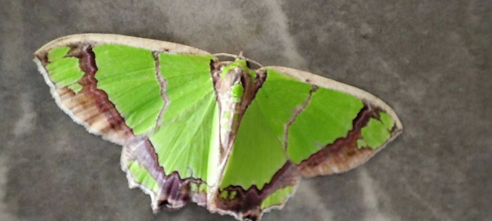

> Why拍摄于2021年9月6日B区b03楼。

焦斑艳青尺蛾(Agathia curvifiniens Prout)，尺蛾科艳青尺蛾属的一个物种。前翅长22mm。头顶及胸部粉青色，腹部前部粉青，后部灰粉色；前翅外线下部一大斑；后翅外有二突起， 后角上一浅斑有碎纹。翅反面色较淡，斑纹较淡而间断。

## 螟蛾科
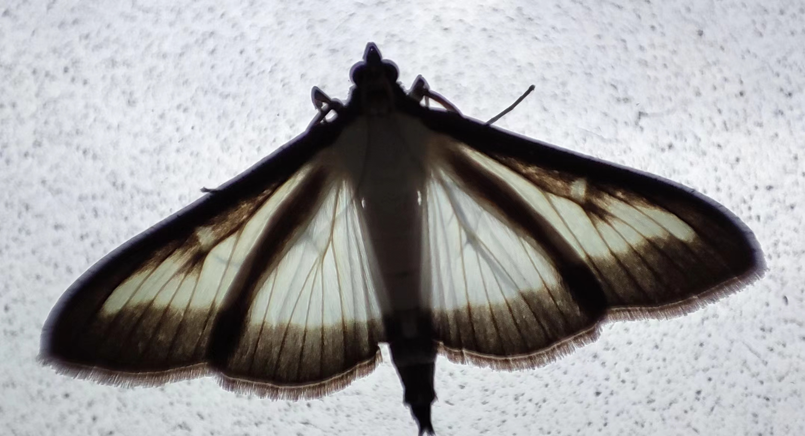

> Why拍摄于2021年9月2日B区b03楼。

螟蛾科(Pyralidae) 为鳞翅目（Lepidoptera）中的一个大科，全世界已记载约1万种，中国已知l000余种，许多种类为农业上的重要害虫。

本科是鳞翅目中最大的科，已知约25000种，可能还有4倍的种类有待描述。本科可分12个亚科，有人分两大类25个亚科。按12个亚科分，我国有11个亚科2000多种。

## 小地老虎
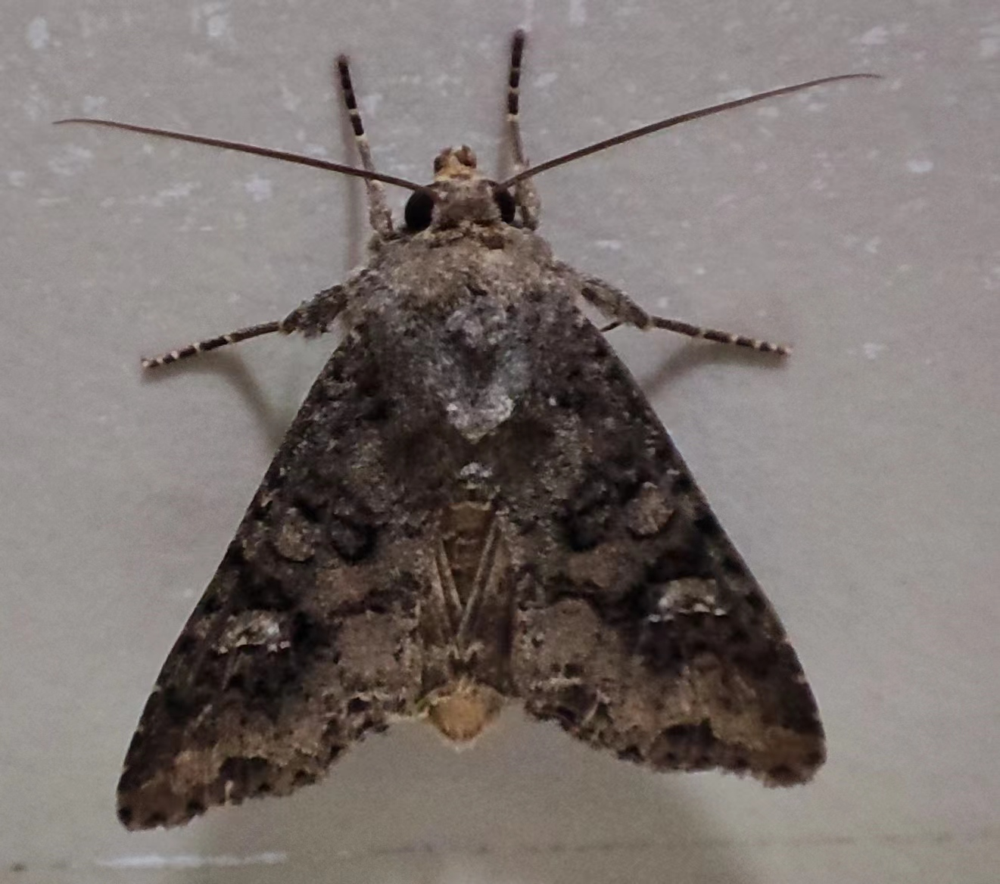

> Why拍摄于2021年9月20日，泓理楼二楼。

小地老虎(Agrotis ypsilon),又名土蚕，切根虫。经历卵，幼虫，蛹，成虫。年发生代数随各地气候不同而异，愈往南年发生代数愈多，以雨量充沛、气候湿润的长江中下游和东南沿海及北方的低洼内涝或灌区发生比较严重；在长江以南以蛹及幼虫越冬，适宜生存温度为 15 ℃～25 ℃ 。对农、林木幼苗危害很大，轻则造成缺苗断垄，重则毁种重播。

## 拟步甲科

> Why拍摄于2022年4月7日，涵英楼北侧马路。

拟步甲科是属昆虫纲鞘翅目中的一科，世界性分布，以沙漠干旱地区多见，世界已知约25000种。我国约276种。小至大型，体长2-50mm，体扁平，多为黑色或暗棕色，暗淡或具有光泽，有的是白色或上有彩色斑纹。头部较小，与前胸密接。口器发达，上颚大形。

## 蝼蛄科
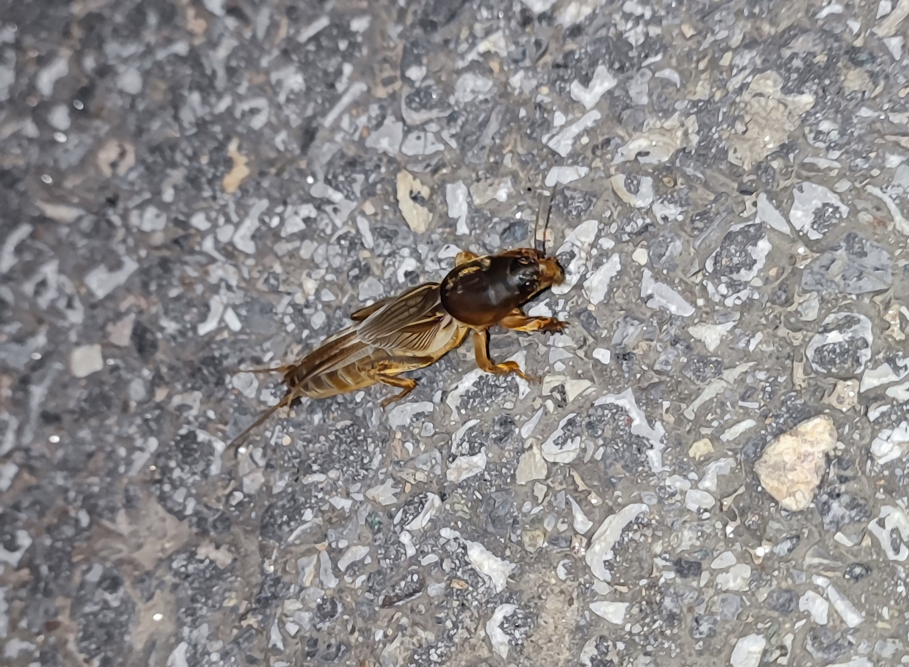

> Why拍摄于2021年9月1日，泓生楼北侧马路。

蝼蛄（Gryllotalpa spps.）是节肢动物门，昆虫纲，直翅目，蟋蟀总科，蝼蛄科昆虫的总称。蝼蛄俗名拉拉蛄，地拉蛄，天蝼，土狗等，是药用昆虫。我国大陆上常见的分布较广的蝼蛄有5种，分别是华北蝼蛄、东方蝼蛄、金秀蝼蛄、河南蝼蛄和台湾蝼蛄。一般入药的主要是华北蝼蛄和东方蝼蛄。药用通常为蝼蛄科昆虫蝼蛄的干燥成虫和大个若虫全体。

华北蝼蛄主要分布在北方各地，东方蝼蛄在中国各地均有分布，南方危害较重。台湾蝼蛄发生于台湾、广东、广西。普通蝼蛄仅分布在新疆

## 螳螂目
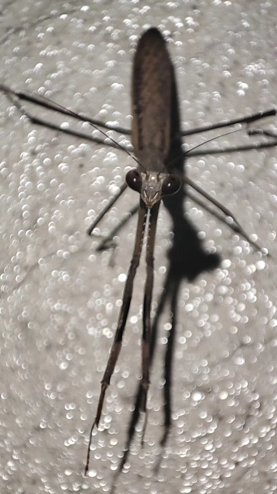

> Why拍摄于2021年8月25日，涵英楼西侧马路。

螳螂目（Mantodea）的昆虫统称螳螂。螳螂属肉食性昆虫，成虫与幼虫均为捕食性，以其他昆虫及小动物为食，是著名的农林业益虫。螳螂产的卵有卵鞘包围，卵鞘称螵蛸。世界已知2200多种，中国已记载8科19亚科47属112种，广泛分布于热带、亚热带和温带的大部分地区。

## 瓢虫

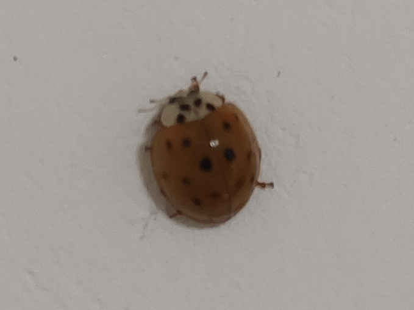

> 德华拍摄于2022年6月18日B11宿舍内。

瓢虫为[鞘翅目](https://baike.baidu.com/item/鞘翅目)瓢虫科（学名：*Coccinellidae*）圆形突起的甲虫的通称，是体色鲜艳的小型昆虫，常具红、黑或黄色斑点。别称为胖小、红娘、花大姐（指[二十八星瓢虫](https://baike.baidu.com/item/二十八星瓢虫/6453561)，这是一种害虫）**、**金龟，甚至因为某些种其分泌物带有臭味而俗称为臭龟子（但这也是混称）。

## 蠼螋
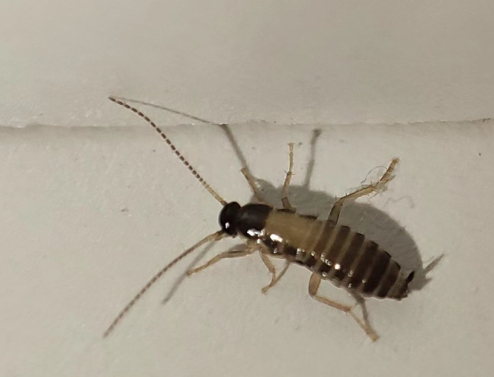

> Why拍摄于2021年8月17日，B区b11某宿舍内。

蠼螋[qú sōu](earwig Furficulidae)是[革翅目](https://baike.baidu.com/item/革翅目/1536309)，[蠼螋科](https://baike.baidu.com/item/蠼螋科/55466174)的统称。体长4mm~35mm，体狭长，略扁平，头扁宽，触角丝状，无单眼，口器咀嚼式；前胸背板发达，方形体表革质，有光泽；前翅特化为极小革翅；后翅大，膜质，扇形或略圆形，常露于前翅外；尾须铗状；无产卵器；腹部第3节、第4节腺褶能分泌特殊臭气驱敌；体尾末端有一对钳状尾铗用于防御。寒带一年一代，以成虫越冬，卵成串产于土表洞穴中，两性同居，有保护子代、喜夜行习性，杂食性；果树害虫的捕食者，少数种为害花卉、储粮、储藏果品、家蚕及新鲜[昆虫](https://baike.baidu.com/item/昆虫/30467)标本，有的是[蝙蝠](https://baike.baidu.com/item/蝙蝠/1209)和[鼠](https://baike.baidu.com/item/鼠/1343312)的体外寄生者。我国已记载211种。

在中国主要地理分布：北京、湖北、河北、山东、山西、河南、**陕西**、江苏、安徽、西藏、新疆。

## 金龟子

金龟子是[鞘翅目](https://baike.baidu.com/item/鞘翅目/1535103)金龟总科(Scarabaeoidea)的通称。其幼虫(蛴螬)是主要地下害虫之一，危害严重，常将植物的幼苗咬断，导致枯黄死亡。多种成虫又是农作物、林木、果树的大害虫。

### 丽金龟

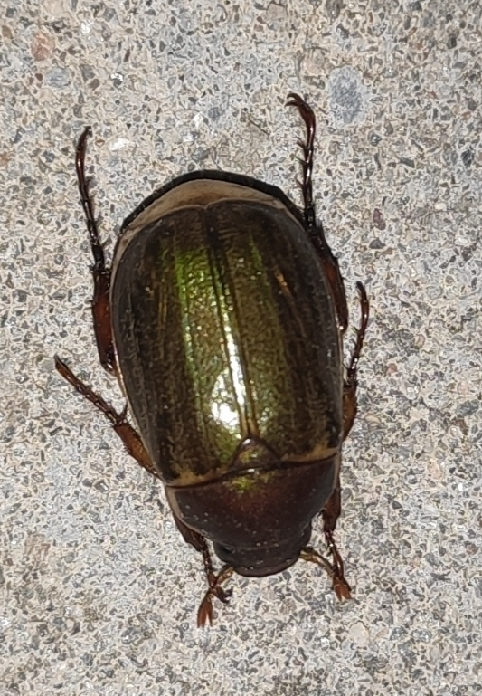

> 德华拍摄于2022年6月21日C区食堂门口。

丽金龟隶属于[鞘翅目](https://baike.baidu.com/item/鞘翅目/1535103)（Coleoptera）金龟科（Scarabaeidae）丽金龟亚科（Rutelinae）。 全世界已知 4000 余种，我国已知约 460 种 。丽金龟是丽金龟亚科昆虫的统称，多数种有金属光泽，多分布于[热带](https://baike.baidu.com/item/热带/802518)和[亚热带地区](https://baike.baidu.com/item/亚热带地区/4036825)，且多为害虫。在中国分布广泛。

### 暗黑鳃金龟

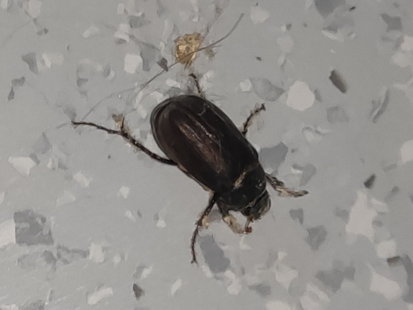

> 德华拍摄于2022年6月22日四号巨构楼内。

暗黑鳃金龟，昆虫，鞘翅目、金龟科，分布在我国20余个省（区）市，是花生、豆类、粮食作物的重要地下害虫，就分布之广、危害之重而言，在金龟子类中逐渐上升到首位。防治此害虫，要以农业防治为基础，结合物理、化学等方法防治。

## 斑衣蜡蝉

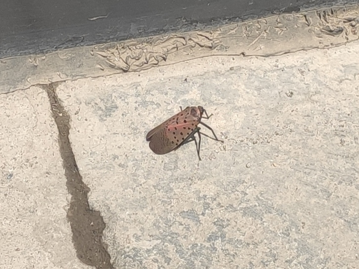

> 德华拍摄于2022年6月30日C道科广场外。

[斑衣蜡蝉](https://baike.baidu.com/item/%E6%96%91%E8%A1%A3%E8%9C%A1%E8%9D%89/866324?fr=aladdin)（学名：Lycorma delicatula）是同翅目蜡蝉科的昆虫，民间俗称“花姑娘”、“椿蹦”、“花蹦蹦”、“灰花蛾”等。属于不完全变态，不同龄期体色变化很大。小龄若虫体黑色，上面具有许多小白点。大龄若虫身体通红，体背有黑色和白色斑纹。成虫后翅基部红色，飞翔时可见。成虫、若虫均会跳跃，成虫飞行能力弱。在多种植物上取食活动，吸食植物汁液，最喜臭椿。斑衣蜡蝉是多种果树及经济林树木上的重要害虫之一，同时也是一种药用昆虫，虫体晒干后可入药，称为“樗鸡”。

## 蜜蜂

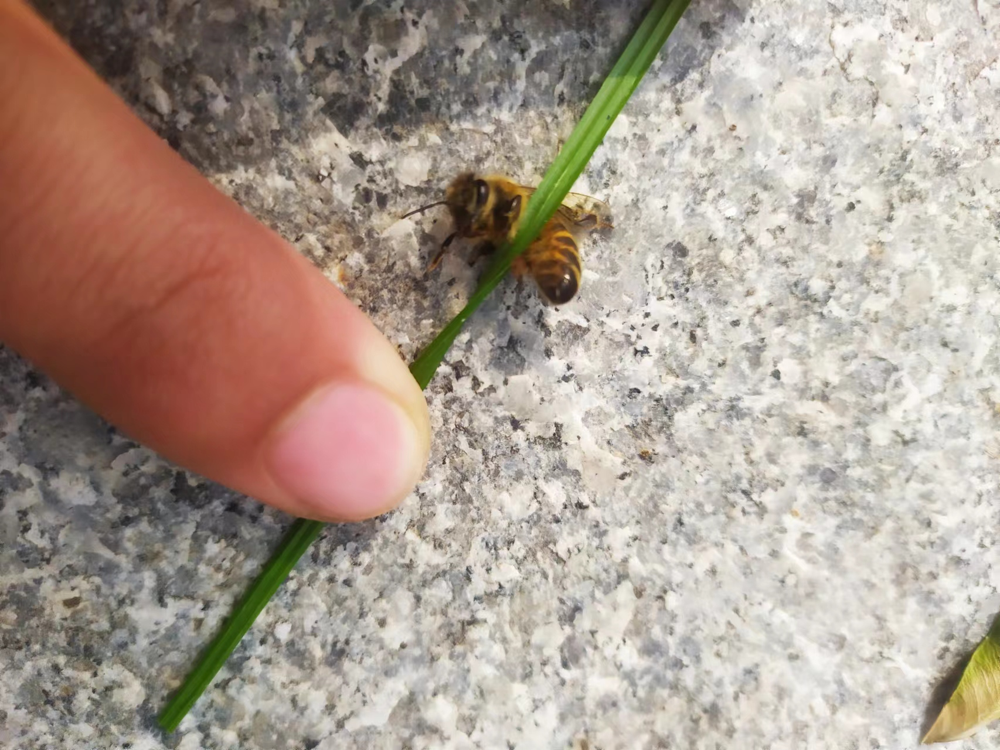

> 伤不起拍摄于2022年 具体时间未知，地点未知（大概在操场旁边）

中华蜜蜂主要特征：躯体较小，头胸部呈黑色，[蜂王](https://baike.baidu.com/item/蜂王/2343445)体长17.5mm左右，体色呈黑色或棕红色，全身被覆黑色和深黄色绒毛。工蜂体长11mm左右，喙长5mm左右，腹节背板呈黑色黄色环，处于高纬度、高山区的中蜂腹部色泽偏黑，处于低纬度、平原区的中蜂腹部色泽偏黄，全身被覆灰色短绒毛。雄蜂体长12.5mm左右，体色呈黑色或黑棕色，全身被覆灰色绒毛。中蜂耐寒性较强，飞行敏捷，蜜源缺乏或病虫害侵袭时易飞逃，适宜在山区、半山区的生态环境中饲养。

## 蜘蛛

### 中华狼蛛（存疑）

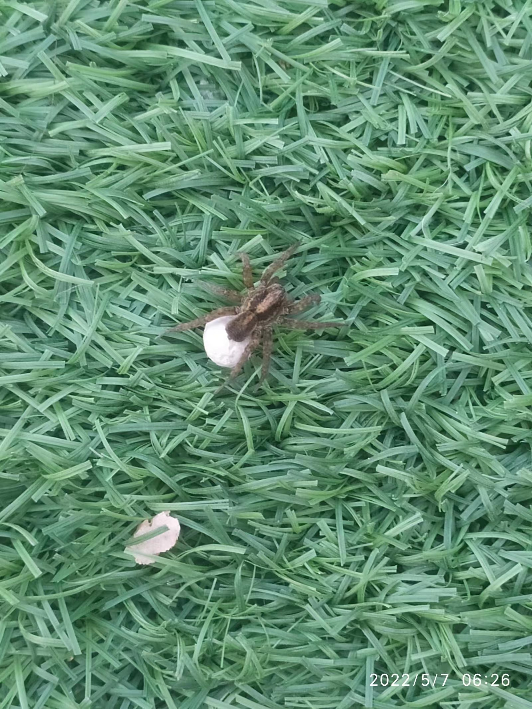

> 伤不起拍摄于2022年5月7日操场

全身密生黑色、白色及黄色细毛，头胸部、背面棕褐色，中央有一黄棕色纵斑。前宽后窄，中窝明显，体长3～4厘米。为穴居蜘蛛，多在平原地区的棉花、小麦、大豆等作物田间挖穴筑巢。产于陕西、山东、河南等省。

## 天牛

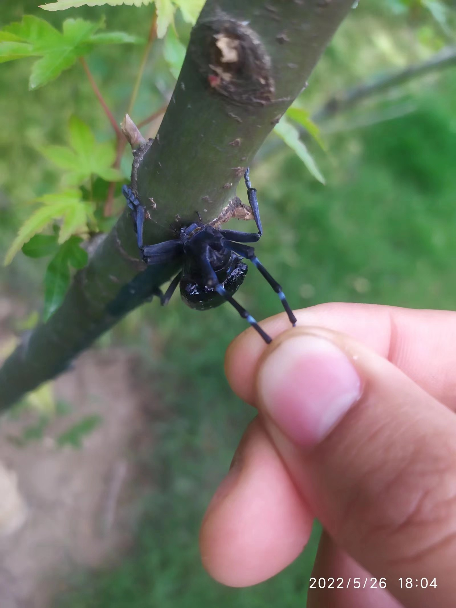

> 伤不起拍摄于2022年5月26日，地点未知（大概C区旁边小林）

天牛是多食亚目[天牛科](https://baike.baidu.com/item/天牛科)昆虫的总称，[咀嚼式口器](https://baike.baidu.com/item/咀嚼式口器/737985)，有很长的触角，常常超过身体的长度，全世界约有超过20,000种。有一些种类属于害虫，其幼虫生活于木材中，可能对[树](https://baike.baidu.com/item/树/18483)或建筑物造成[危害](https://baike.baidu.com/item/危害/1950382)。

天牛是[植食性昆虫](https://baike.baidu.com/item/植食性昆虫/9516767)，会危害木本[植物](https://baike.baidu.com/item/植物/142914)，大部分松、柏、柳、[榆](https://baike.baidu.com/item/榆/4556356)、核[桃](https://baike.baidu.com/item/桃/64247)、[柑橘](https://baike.baidu.com/item/柑橘/55204)、苹果、[桃](https://baike.baidu.com/item/桃)和茶等，一部分棉、麦、玉米、[高粱](https://baike.baidu.com/item/高粱/2862)、甘蔗和麻等，少数木材、建筑、房屋和家具等，是林业生产、作物栽培和建筑木材上的主要害虫。

## 灰蝶

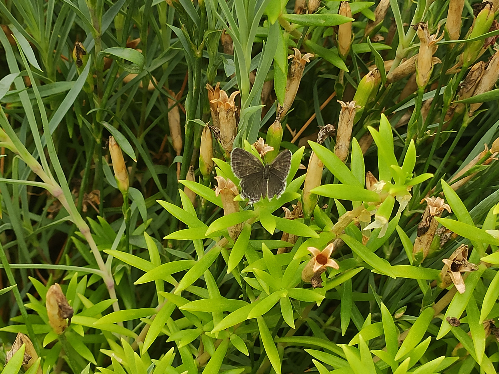

> 德华拍摄于2022年7月12日四号楼顶。

灰蝶 gossamer-winged butterfly ，[鳞翅目](https://baike.baidu.com/item/鳞翅目)(Lepidoptera)[灰蝶科](https://baike.baidu.com/item/灰蝶科/3176638)(Lycaenidae)的昆虫。均为中型或小型蝶类(翅展1～3公分)，敏捷，纤细。全世界已记载4 500余种，分布全世界；中国已知279种。

## 蜗牛

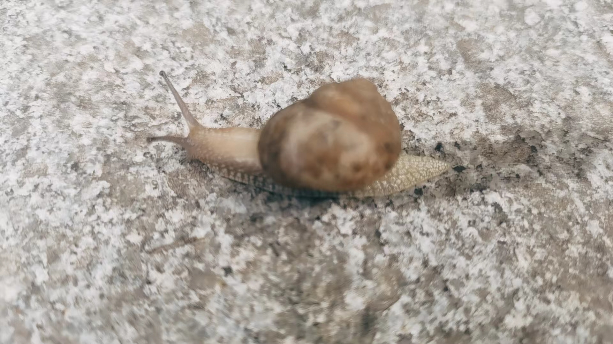

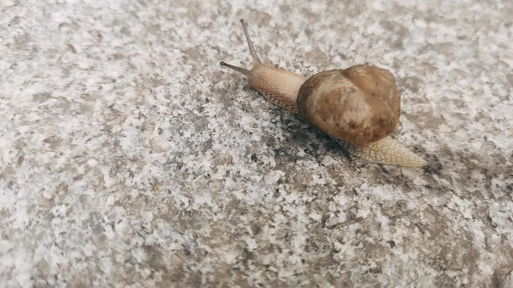

> gtx拍摄于2022年7月22日四号楼顶

蜗牛是指[腹足纲](https://baike.baidu.com/item/腹足纲)的陆生所有种类。一般西方语言中不区分水生的[螺类](https://baike.baidu.com/item/螺类/6523815)和陆生的蜗牛，汉语中蜗牛只指陆生种类,而广义的蜗牛还包括巨盾[蛞蝓](https://baike.baidu.com/item/蛞蝓/24262)。蜗牛是一种包括许多不同科、属的动物。取食植物，产卵于土中或者树上。在热带岛屿比较常见，但有的也生存在寒冷地区。树栖种类的色泽鲜艳，而地栖的通常几种接近的颜色，一般有条纹。

## 蝉

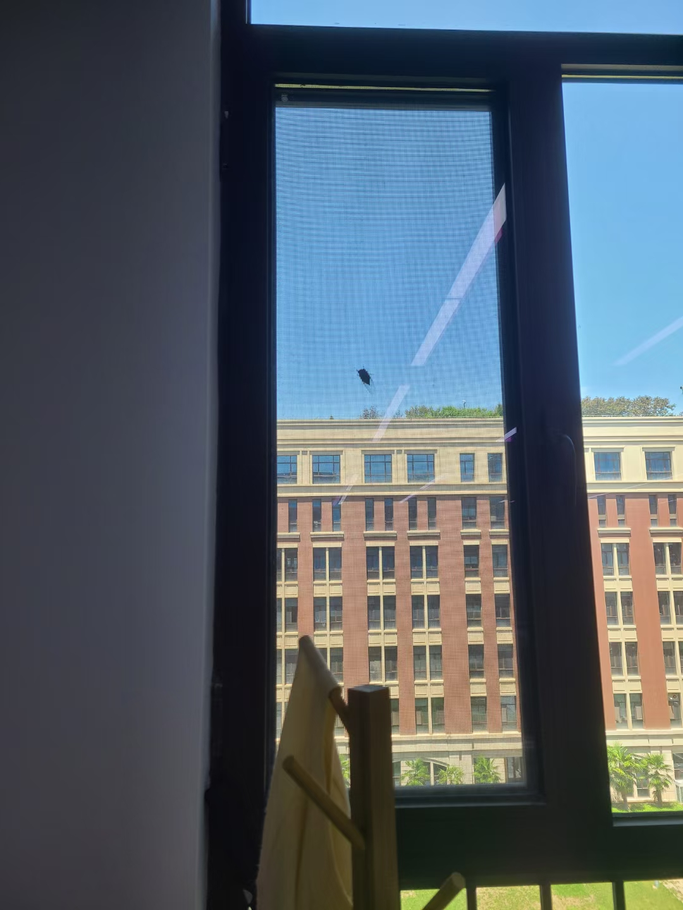

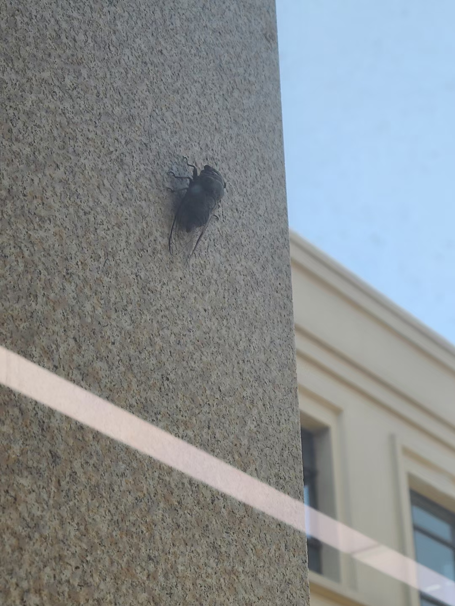

> 朋友圈师姐发的，原作者看到可以联系我哦

蝉有两对[膜翅](https://baike.baidu.com/item/膜翅?fromModule=lemma_inlink)，形状基本相同，头部宽而短，具有明显突出的额唇基；视力相当良好，复眼不大，位于头部两侧且分得很开，有3个[单眼](https://baike.baidu.com/item/单眼?fromModule=lemma_inlink)。[触角](https://baike.baidu.com/item/触角/6268842?fromModule=lemma_inlink)短，呈刚毛状。[口器](https://baike.baidu.com/item/口器?fromModule=lemma_inlink)细长，口器内有[食管](https://baike.baidu.com/item/食管?fromModule=lemma_inlink)与[唾液](https://baike.baidu.com/item/唾液?fromModule=lemma_inlink)管，属于刺吸式。胸部则包括[前胸](https://baike.baidu.com/item/前胸?fromModule=lemma_inlink)、[中胸](https://baike.baidu.com/item/中胸?fromModule=lemma_inlink)及[后胸](https://baike.baidu.com/item/后胸?fromModule=lemma_inlink)，其中前胸和中胸较长。3个胸部都具有一对足，腿节粗壮发达（若虫前脚用来挖掘，腿节膨大，带刺）。蝉的腹部呈长锥形，总共有10个[腹节](https://baike.baidu.com/item/腹节?fromModule=lemma_inlink)，第9腹节成为[尾节](https://baike.baidu.com/item/尾节?fromModule=lemma_inlink)。雄蝉第1、第2腹节具发音器，第10腹节形成肛门；雌蝉第10腹节形成[产卵管](https://baike.baidu.com/item/产卵管?fromModule=lemma_inlink)，且较为膨大。幼虫生活在土中，末龄幼虫多为棕色，与[成虫](https://baike.baidu.com/item/成虫?fromModule=lemma_inlink)相似。