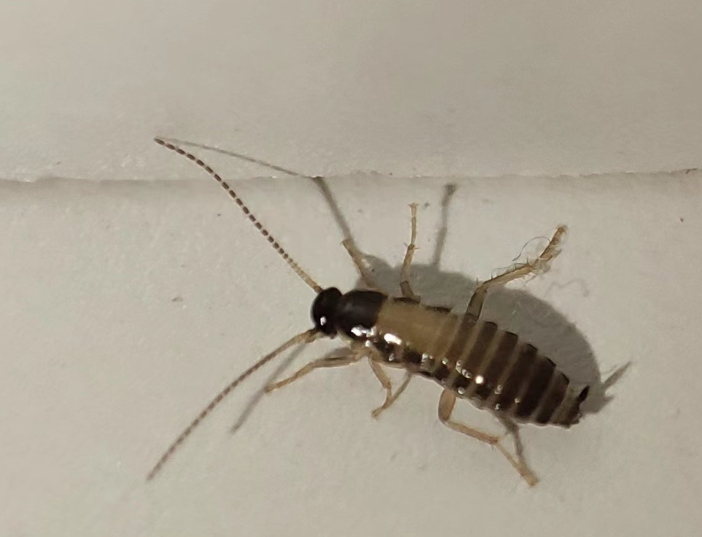

# 小型动物

## 中华露螽

> 德华拍摄于2022年6月15日四号巨构楼内。

中华露螽（ Phaneroptera sinensis Uvarov)属昆虫纲直翅目，是一种常见的昆虫。该科种类与自然植被关系密切,有些种类是重要的害虫,有些种类对环境变化非常敏感,是重要的生态指示种.它们许多种类具有明显的经济学意义

寄生范围：瓜、菜豆、蔬菜。

地理分布：陕西；庆阳（正宁）。

*到工位上班的时候看到地上趴着一个绿虫子，所以拍下来查了一下。*

## 东亚飞蝗

> Why拍摄于2021年8月30日四号巨构2楼。

东亚飞蝗（Locusta migratoria manilensis）是飞蝗科、飞蝗属昆虫飞蝗下的一个亚种。体大型，绿色或黄褐色，匀称。东亚飞蝗主要分布在中国东部，黄淮海平原是主要发生和危害区域。

## 蟋蟀

> Why拍摄于2021年8月21日B区b11楼。

> Why拍摄于2021年8月21日B区b11楼。

蟋蟀（Gryllulus）无脊椎动物，昆虫纲，直翅目，蟋蟀总科。亦称促织，俗名蛐蛐、夜鸣虫（因为它在夜晚鸣叫）、将军虫。蟋蟀是一种古老的昆虫，至少已有1.4亿年的历史，还是在古代和现代玩斗的对象。

## 蟑螂

> Why拍摄于2021年9月1日B区b11楼。

蟑螂， 属于节肢动物门、昆虫纲、蜚蠊目（Blattaria），俗称蟑螂，是常见的医学昆虫。蟑螂体扁平，黑褐色，通常中等大小。头小，能活动。触角长丝状，复眼发达。翅平，前翅为鞘翅后翅为膜翅，前后翅基本等大，覆盖于腹部背面；有的种类无翅。不善飞，能疾走。不完全变态。产卵于卵鞘内，约有6000种，主要分布在热带、亚热带地区，生活在野外或者室内。

## 焦斑艳青尺蛾

 
> Why拍摄于2021年9月6日B区b03楼。

焦斑艳青尺蛾(Agathia curvifiniens Prout)，尺蛾科艳青尺蛾属的一个物种。前翅长22mm。头顶及胸部粉青色，腹部前部粉青，后部灰粉色；前翅外线下部一大斑；后翅外有二突起， 后角上一浅斑有碎纹。翅反面色较淡，斑纹较淡而间断。

## 螟蛾科

> Why拍摄于2021年9月2日B区b03楼。

螟蛾科(Pyralidae) 为鳞翅目（Lepidoptera）中的一个大科，全世界已记载约1万种，中国已知l000余种，许多种类为农业上的重要害虫。

本科是鳞翅目中最大的科，已知约25000种，可能还有4倍的种类有待描述。本科可分12个亚科，有人分两大类25个亚科。按12个亚科分，我国有11个亚科2000多种。

## 小地老虎

> Why拍摄于2021年9月20日，泓理楼二楼。

小地老虎(Agrotis ypsilon),又名土蚕，切根虫。经历卵，幼虫，蛹，成虫。年发生代数随各地气候不同而异，愈往南年发生代数愈多，以雨量充沛、气候湿润的长江中下游和东南沿海及北方的低洼内涝或灌区发生比较严重；在长江以南以蛹及幼虫越冬，适宜生存温度为 15 ℃～25 ℃ 。对农、林木幼苗危害很大，轻则造成缺苗断垄，重则毁种重播。

## 拟步甲科

> Why拍摄于2022年4月7日，涵英楼北侧马路。

拟步甲科是属昆虫纲鞘翅目中的一科，世界性分布，以沙漠干旱地区多见，世界已知约25000种。我国约276种。小至大型，体长2-50mm，体扁平，多为黑色或暗棕色，暗淡或具有光泽，有的是白色或上有彩色斑纹。头部较小，与前胸密接。口器发达，上颚大形。

## 蝼蛄科

> Why拍摄于2021年9月1日，泓生楼北侧马路。

蝼蛄（Gryllotalpa spps.）是节肢动物门，昆虫纲，直翅目，蟋蟀总科，蝼蛄科昆虫的总称。蝼蛄俗名拉拉蛄，地拉蛄，天蝼，土狗等，是药用昆虫。我国大陆上常见的分布较广的蝼蛄有5种，分别是华北蝼蛄、东方蝼蛄、金秀蝼蛄、河南蝼蛄和台湾蝼蛄。一般入药的主要是华北蝼蛄和东方蝼蛄。药用通常为蝼蛄科昆虫蝼蛄的干燥成虫和大个若虫全体。

华北蝼蛄主要分布在北方各地，东方蝼蛄在中国各地均有分布，南方危害较重。台湾蝼蛄发生于台湾、广东、广西。普通蝼蛄仅分布在新疆

## 螳螂目

> Why拍摄于2021年8月25日，涵英楼西侧马路。

螳螂目（Mantodea）的昆虫统称螳螂。螳螂属肉食性昆虫，成虫与幼虫均为捕食性，以其他昆虫及小动物为食，是著名的农林业益虫。螳螂产的卵有卵鞘包围，卵鞘称螵蛸。世界已知2200多种，中国已记载8科19亚科47属112种，广泛分布于热带、亚热带和温带的大部分地区。

## 待鉴定

> Why拍摄于2021年8月17日，B区b11某宿舍内。

