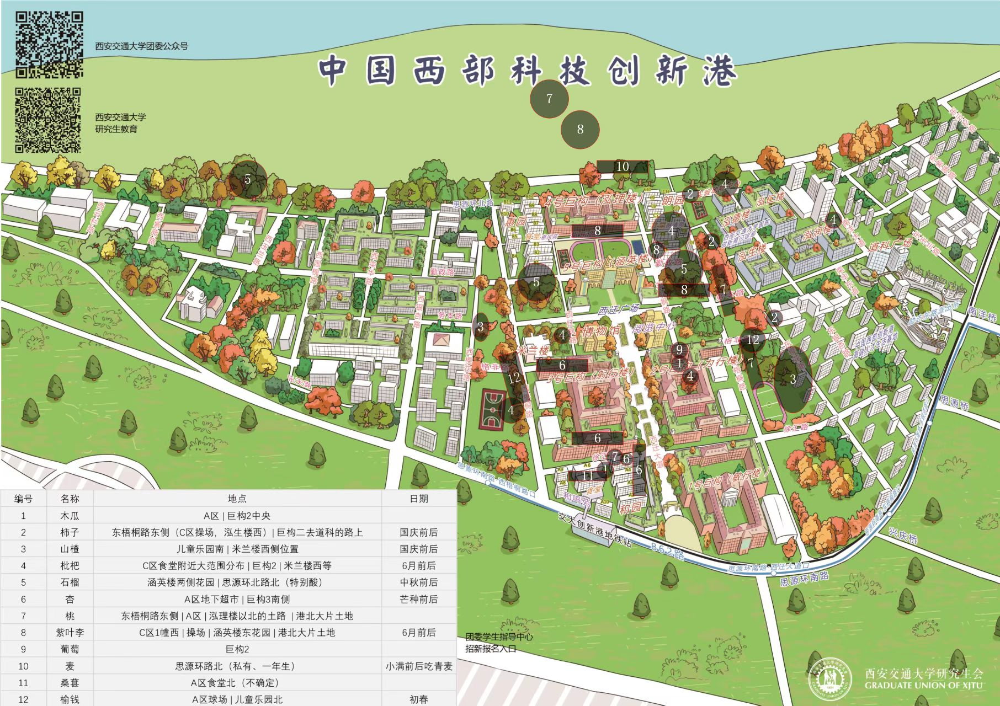
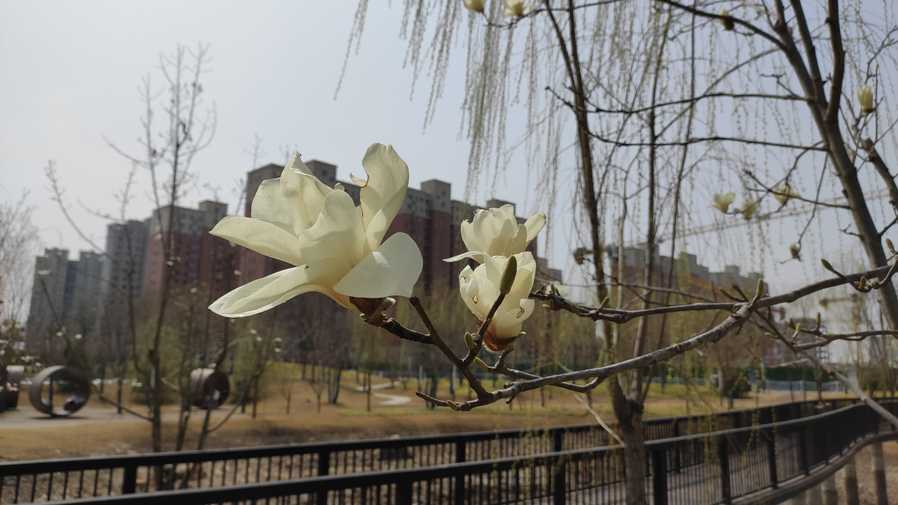
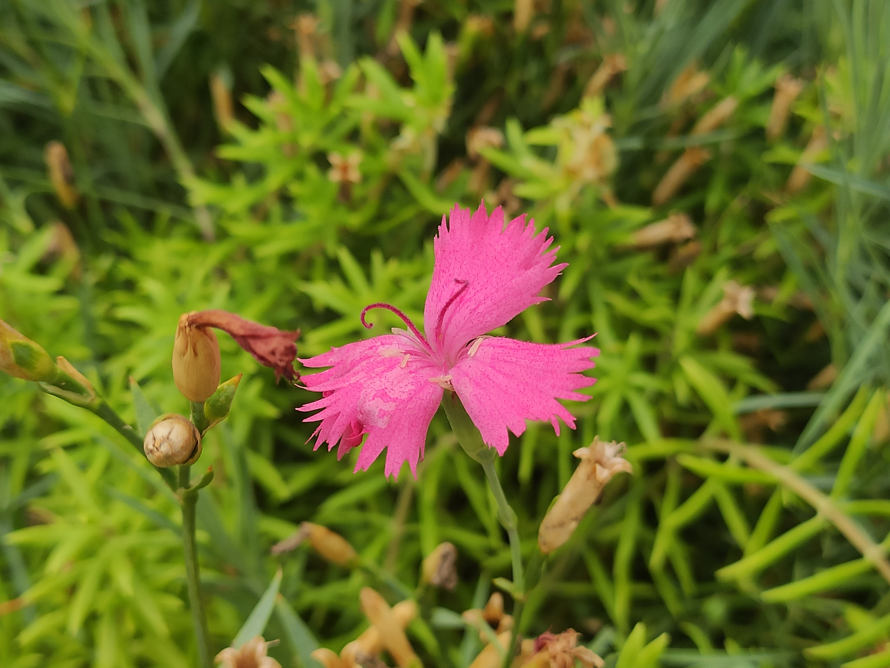
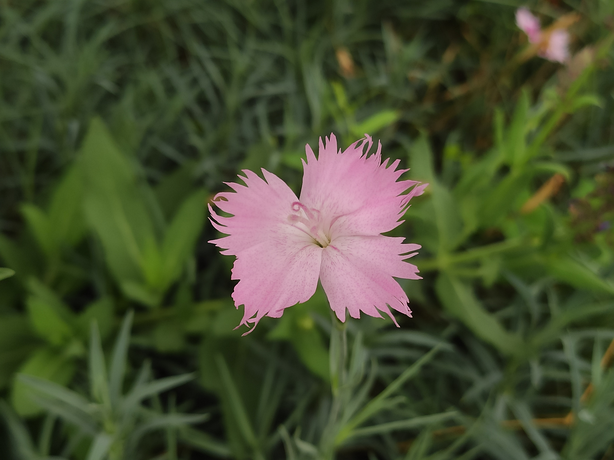
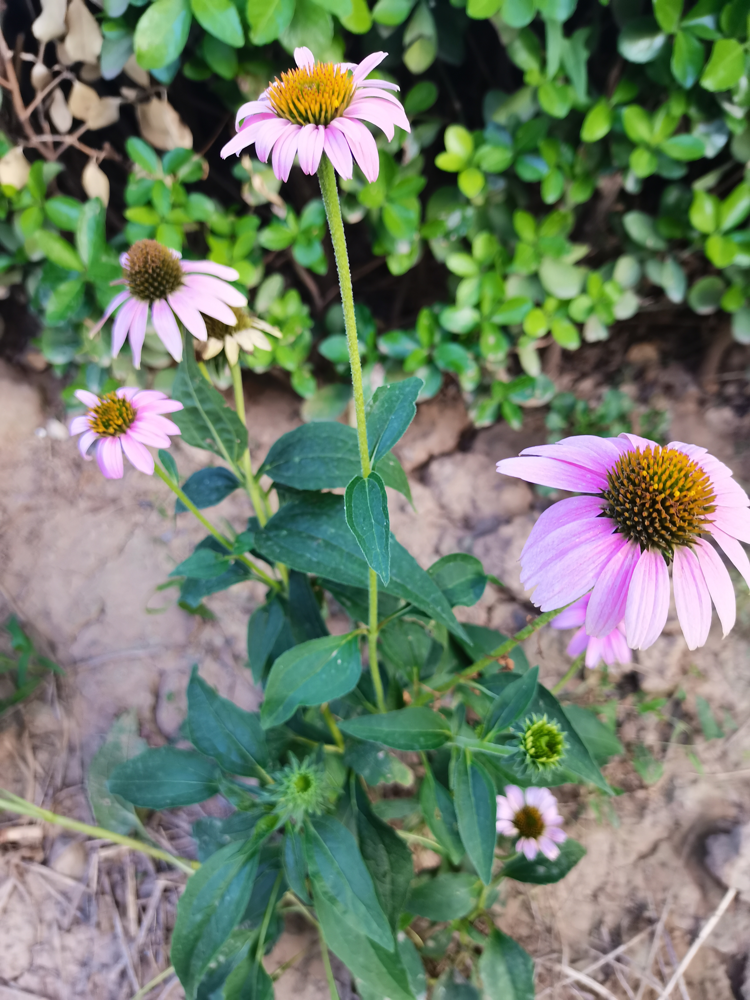
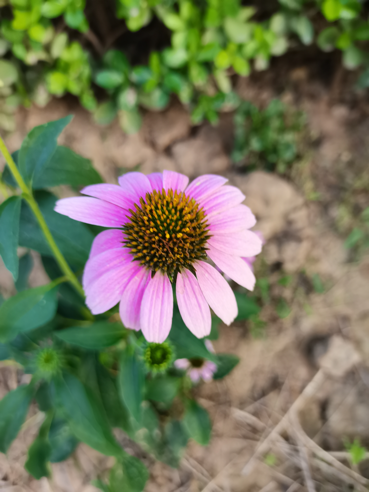

# 植物

创新港果树分布图鉴 ver 1.0

> 伤不起2022年7月11日供稿

## 银杏

> 德华拍摄于2021年10月26日篮球场门口。

银杏（学名：*Ginkgo biloba*  L.）是银杏科、银杏属植物。

*学校东西银杏路和田径场两侧种了很多银杏，到了秋天特别美，好多人还用银杏叶制作花朵。*

## 红枫

> 德华拍摄于2021年10月21日涵英楼东侧。

红枫（学名：*Acer palmatum 'Atropurpureum'*）是槭树科、槭属、鸡爪槭的一个品种。

*学校东西红枫路种了很多红枫树，到了秋天特别好看。*

## 玉兰

> 德华拍摄于2021年3月12日西玉兰路。

> 德华拍摄于2022年8月29日西玉兰路

玉兰（学名：*Yulania denudata* (Desrousseaux) D. L. Fu）是木兰科、玉兰属植物。落叶乔木。

*学校东西玉兰路有好多玉兰树，在早春开花特别漂亮。玉兰的果实像红色的麻花，貌似有毒。*

## 红叶碧桃

> 德华拍摄于2022年3月18日四号楼顶。

> XWD拍摄于2022年5月21日四号楼顶。

> 德华拍摄于2022年7月12日四号楼顶。

> 德华拍摄于2022年8月30日四号楼顶

> 德华拍摄于2022年8月30日四号楼工位

红叶碧桃（学名：*Prunus persica 'Atropurpurea'*）是蔷薇科、桃属植物。红叶碧桃是碧桃的一个变异品种。

碧桃（学名：*Amygdalus persica* L. var. *persica* f. *duplex* Rehd.）：是植物桃的变种，属于观赏桃花类的半重瓣及重瓣品种，统称为碧桃。

*四号楼楼顶有好多党支部捐赠的植物，红叶碧桃开花比较早，在早春就盛开了。碧桃在8月底就大量成熟，比普通的桃子稍微涩一点，不过也很甜很好吃。*

## 桃花

> 德华拍摄于2022年3月20日四号楼顶。

桃花，属[蔷薇科植物](https://baike.baidu.com/item/蔷薇科植物/3334758)。叶椭圆状[披针形](https://baike.baidu.com/item/披针形/10957416)，[核果](https://baike.baidu.com/item/核果/5824235)近球形，主要分果桃和花桃两大类。

## 西府海棠

> 德华拍摄于2022年3月20日四号楼顶。

西府海棠（学名：Malus micromalus），为[木兰纲](https://baike.baidu.com/item/木兰纲)、蔷薇科、[苹果属](https://baike.baidu.com/item/苹果属)的植物，小乔木，高达2.5-5米，树枝直立性强，为中国的特有植物。西府海棠在北方干燥地带生长良好，是绿化工程中较受欢迎的产品。

*真的好漂亮呀，我最喜欢的花。*

> 德华拍摄于2022年7月12日四号楼顶。

海棠花的果实叫海棠果，也叫楸子。分布于河北、山东、山西、河南、陕西、甘肃、辽宁、内蒙古等省区野生或栽培。生长于海拔50-1300米的山坡、平地或山谷梯田边。

## 重瓣棣棠花

> 德华拍摄于2022年4月3日四号楼顶。

> XWD拍摄于2022年5月21日四号楼顶。

重瓣棣棠花（学名：*Kerria japonica* (L.) DC. f. *pleniflora* (Witte) Rehd.）是[棣棠花](https://baike.baidu.com/item/棣棠花/965714)的变种，为落叶灌木，高1米至1.5米，小枝绿色，有条纹，略呈曲折状；叶三角状卵形，先端渐尖，基部近圆形，长2厘米至5厘米，边缘有重锯齿，表面鲜绿色，背面苍白而微有细毛；花金黄色顶生于侧枝上，重瓣，花径3厘米至4.5厘米，花期4月至5月，[瘦果](https://baike.baidu.com/item/瘦果/1407632)褐黑色。

## 林荫鼠尾草

> XWD拍摄于2022年5月21日四号楼顶。

林荫鼠尾草（学名：Salvia nemorosa），唇形科鼠尾草属多年生草本植物，耐寒。

## 南天竹

> XWD拍摄于2022年5月21日四号楼顶。

> XWD拍摄于2022年5月21日四号楼顶。

南天竹，别名：南天竺，红杷子，天烛子，红枸子，钻石黄，天竹，兰竹；拉丁文名：Nandina domestica.属毛茛目、小檗科下植物，是我国南方常见的木本花卉种类。

## 大花萱草

> 德华拍摄于2022年6月22日一号楼顶。

大花萱草（学名：*Hemerocallis hybrida* Bergmans）是百合科，萱草属多年生宿根[草本](https://baike.baidu.com/item/草本/541696)植物，根状茎粗壮，肉质根。叶基生、宽线形、对排成列，背面有龙骨突起，嫩绿色。花薹由叶丛中抽出，聚伞花序或圆锥花序，有花枝，花色模式有单色、复色和混合色。花大，漏斗形、钟形、星形等，外花被[裂片](https://baike.baidu.com/item/裂片/1893009)倒披针形或长圆形，内花被裂片倒披针形或卵形，花药黄色、红色、橙色或紫色等多种颜色。子房上位，纺锤形，果实呈嫩绿色，蒴果背裂，5-10月开花。

## 石榴

> 德华拍摄于2022年6月22日一号楼顶。

> 德华拍摄于2022年8月29日B区外绿化带。

*学校的石榴虽然是观赏石榴，但是也可以吃，酸酸甜甜的，八月底熟的还不多，九月份就大量成熟了。*

石榴（拉丁名：*Punica granatum L.*）落叶[乔木](https://baike.baidu.com/item/乔木/33239)或[灌木](https://baike.baidu.com/item/灌木)；落叶灌木或乔木，高2—7米，稀达10米；幼枝常具棱角，老枝近圆形，顶端常具锐尖长刺。叶对生或近簇生，纸质，长圆形或倒卵形，长2—9厘米，宽1—2厘米，先端钝或微凹或短尖，基部稍钝，叶面亮绿色，背面淡绿色，无毛，中脉在背面凸起，侧脉细而密；叶柄长5—7毫米。

原产巴尔干半岛至[伊朗](https://baike.baidu.com/item/伊朗)及其邻近地区，全世界的[温带](https://baike.baidu.com/item/温带)和[热带](https://baike.baidu.com/item/热带)都有种植。

## 木槿

> 德华拍摄于2022年7月3日B11楼下。粉紫重瓣木槿。

> 德华拍摄于2022年7月12日四号楼顶。短苞木槿。

[木槿](https://baike.baidu.com/item/%E6%9C%A8%E6%A7%BF/941102?fr=aladdin)（学名：Hibiscus syriacus Linn.）：落叶灌木，高3-4米，小枝密被黄色星状绒毛。叶菱形至三角状卵形，长3-10厘米，宽2-4厘米，具深浅不同的3裂或不裂，先端钝，基部楔形，边缘具不整齐齿缺，下面沿叶脉微被毛或近无毛。花单生于枝端叶腋间，花萼钟形，长14-20毫米，密被星状短绒毛，裂片5，三角形；花朵色彩有纯白、淡粉红、淡紫、紫红等，花形呈钟状，有单瓣、复瓣、重瓣几种。外面疏被纤毛和星状长柔毛。蒴果卵圆形，直径约12毫米，密被黄色星状绒毛；种子肾形，背部被黄白色长柔毛。花期7-10月。

[粉紫重瓣木槿](https://baike.baidu.com/item/%E7%B2%89%E7%B4%AB%E9%87%8D%E7%93%A3%E6%9C%A8%E6%A7%BF/1240983)（学名：Hibiscus syriacus f. amplissimus）为锦葵科木槿属木槿下的一个变型，为多年生灌木，生长速度快，可1年种植多年采收。分布于中国大陆的山东等地。喜光、耐半阴；喜温暖湿润气候，耐寒；适应性强，耐干旱及耐贫瘠土壤，不耐积水，耐修剪；对二氧化硫抗性强 。

[短苞木槿](https://baike.baidu.com/item/%E7%9F%AD%E8%8B%9E%E6%9C%A8%E6%A7%BF/10886910)变种的叶菱形，基部楔形，小苞片极小，丝状，长3-5毫米，宽0.5-1毫米；花淡紫色，单瓣。产中国广东、福建和山东省。栽培。

## 紫薇

> 德华拍摄于2022年7月6日19号楼边小河旁。

紫薇（学名：*Lagerstroemia indica*  L.）是千屈菜科、紫薇属植物。落叶灌木或小乔木。紫薇高可达7米，枝干多扭曲、小枝纤细，树皮平滑、灰色或灰褐色；叶互生或有时对生，纸质，椭圆形、阔矩圆形或倒卵形，幼时绿色至黄色，成熟时或干燥时呈紫黑色，室背开裂；种子有翅，长约8毫米；花期6-9月，果期9-12月。

原产亚洲，广植于热带地区。中国广东、广西、湖南、福建、江西、浙江、江苏、湖北、河南、河北、山东、安徽、陕西、四川、云南、贵州及吉林均有生长或栽培；半阴生，喜生于肥沃湿润的土壤上，也能耐旱，不论钙质土或酸性土都生长良好。

紫薇树姿优美，树干光滑洁净，花色艳丽；开花时正当夏秋少花季节，花期长，故有“百日红”之称，又有“盛夏绿遮眼，此花红满堂”的赞语，是观花、观干、观根的盆景良材；根、皮、叶、花皆可入药。

## 鸡爪槭

> 德华拍摄于2022年7月6日3号楼西侧。

> 德华拍摄于2022年7月14日B南区菜鸟驿站。

鸡爪槭（学名：*Acer palmatum Thunb.*）是槭树科，槭属落叶小乔木；树冠伞形。树皮平滑。树皮深灰色。小枝紫或淡紫绿色,老枝淡灰紫色。叶近圆形，基部心形或近心形，掌状，常7深裂，密生尖锯齿。后叶开花；花紫色，杂性，雄花与两性花同株；伞房花序。萼片卵状披针形；花瓣椭圆形或倒卵形。幼果紫红色，熟后褐黄色，果核球形，脉纹显著，两翅成钝角。花果期5～9月。

分布于中国华东、华中至西南等省区。生于低海拔的林边或[疏林](https://baike.baidu.com/item/疏林)中。朝鲜和日本也有分布。各国早已引种栽培，其中有[红槭](https://baike.baidu.com/item/红槭/4806144)和[羽毛槭](https://baike.baidu.com/item/羽毛槭/10330447)常作园林树种。

鸡爪槭喜欢阳光，忌西射，西射会焦叶。较耐阴，在高大树木庇荫下长势良好。对二氧化硫和烟尘抗性较强。其叶形美观，入秋后转为鲜红色，色艳如花，灿烂如霞，为优良的观叶树种。

## 打碗花

> 德华拍摄于2022年7月12日四号楼顶

打碗花（学名：*Calystegia hederacea* Wall.ex.Roxb.），又名“小旋花”“燕覆子”等，是旋花科，打碗花属[草本植物](https://baike.baidu.com/item/草本植物/719271)。全体不被毛，植株通常矮小，常自基部分枝，具细长白色的根；茎细，有细棱；叶片基部心形或戟形；花腋生，花梗长于叶柄，苞片宽卵形；蒴果卵球形，种子黑褐色，表面有小疣。

## 石竹

> 德华拍摄于2022年7月12日四号楼顶

石竹，别名：兴安石竹、北石竹、钻叶石竹、蒙古石竹、丝叶石竹、高山石竹、 辽东石竹、长萼石竹、长苞石竹、林生石竹、三脉石竹，瞿麦草，拉丁文名：Dianthus chinensis L.  为[双子叶植物纲](https://baike.baidu.com/item/双子叶植物纲)、[石竹科](https://baike.baidu.com/item/石竹科)、[石竹属](https://baike.baidu.com/item/石竹属/10553338)多年生草本，高30-50厘米，全株无毛，带粉绿色。茎由根颈生出，疏丛生，直立，上部分枝。叶片线状披针形，顶端渐尖，基部稍狭，全缘或有细小齿，中脉较显。花单生枝端或数花集成聚伞花序；紫红色、粉红色、鲜红色或白色，顶缘不整齐齿裂，喉部有斑纹，疏生髯毛；雄蕊露出喉部外，花药蓝色；子房长圆形，花柱线形。蒴果圆筒形，包于宿存萼内，种子黑色，扁圆形。花期5-6月，果期7-9月。

## 龙爪槐

> 德华拍摄于2022年7月12日四号楼顶

龙爪槐是[国槐](https://baike.baidu.com/item/国槐/3114869)的芽变品种，落叶乔木、喜光、稍耐阴、能适应干冷气候。树冠优美，花芳香，是行道树和优良的蜜源植物；花和荚果入药，有清凉收敛、止血降压作用；叶和根皮有清热解毒作用，可治疗疮毒；木材供建筑用。本种由于生境不同，或由于人工选育结果，形态多变，产生许多变种和变型。花期7\~8月，果期8\~10月。

## 木瓜

> 德华拍摄于2022年7月18日B北区门口。

木瓜（学名：*Chaenomeles sinensis* (Thouin)  Koehne）是蔷薇科、木瓜属植物。灌木或小乔木，高达5-10米，叶片椭圆卵形或椭圆长圆形，稀倒卵形，长5-8厘米，宽3.5-5.5厘米，叶柄长5-10毫米，微被柔毛，有腺齿；果实长椭圆形，长10-15厘米，暗黄色，木质，味芳香，果梗短。花期4月，果期9-10月。

## 松果菊

> 谢维栋拍摄于2022年8月12日三号楼天台。

松果菊（学名：Echinacea purpurea (Linn.) Moench）是菊科松果菊属植物，多年生草本植物。高50-150厘米，全株有粗毛，茎直立；叶缘具锯齿。基生叶卵形或三角形，茎生叶卯状披针形，叶柄基部略抱茎。头状花序，单生或多数聚生于技顶，花大，直径可达10厘米：花的中心部位凸起，呈球形，球上为管状花，橙黄色；种子浅褐色，外皮硬。花期夏秋。

## 山楂

> 德华拍摄于2022年8月29日A区旁。

山楂（*Crataegus pinnatifida* Bge.），蔷薇科山楂属，山楂的抗衰老作用位居群果之首。 [落叶乔木](https://baike.baidu.com/item/落叶乔木/5201871?fromModule=lemma_inlink)，高可达6米。核质硬，果肉薄，味微酸涩。果可生吃或作果脯果糕，干制后可入药，是中国特有的药果兼用树种，具有降血脂、血压、强心、抗心律不齐等作用，同时也是健脾开胃、消食化滞、活血化痰的良药，对胸膈脾满、疝气、血淤、闭经等症有很好的疗效。山楂内的黄酮类化合物[牡荆素](https://baike.baidu.com/item/牡荆素/3012547?fromModule=lemma_inlink)，是一种抗癌作用较强的药物，其提取物对抑制体内癌细胞生长、增殖和浸润转移均有一定的作用。

## 侧柏

> 德华拍摄于2022年8月29日A区旁。

侧柏（学名：*Platycladus orientalis* （L.) Franco）是柏科侧柏属常绿乔木。树冠广卵形，小枝扁平，排列成1个平面。叶小，鳞片状，紧贴小枝上，呈交叉对生排列，叶背中部具腺槽。[雌雄同株](https://baike.baidu.com/item/雌雄同株/837080?fromModule=lemma_inlink)，花单性。雄球花黄色，由交互对生的小孢子叶组成，每个小孢子叶生有3个花粉囊，珠鳞和苞鳞完全愈合。球果当年成熟，种鳞木质化，开裂，种子不具翅或有棱脊。

侧柏为中国特产，除青海、新疆外，全国均有分布。寿命很长，常有百年和数百年以上的古树。已被选为北京市的[市树](https://baike.baidu.com/item/市树/8506138?fromModule=lemma_inlink)。

## 蒲苇

> 德华拍摄于2022年8月29日B区旁。

蒲苇（学名：*Cortaderia selloana* (Schult.) Aschers. et  Graebn.）是禾本科、蒲苇属植物。多年生，雌雄异株。秆高大粗壮，丛生，高2-3米。叶舌为一圈密生柔毛，毛长2-4毫米；叶片质硬，狭窄，簇生于秆基，长达1-3米，边缘具锯齿状粗糙。圆锥花序大型稠密；雌花序较宽大，雄花序较狭窄；小穗含2-3小花，雌小穗具丝状柔毛，雄小穗无毛；颖质薄，细长，白色，外稃顶端延伸成长而细弱之芒。

花语：对爱情坚贞不渝的信念与决心。